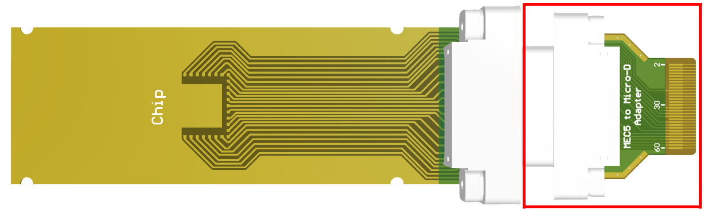

# Micro-D to MEC5 Adapter PCB

This PCB is designed to allow us to use the DC sample holder from the fridge in Josh Folk's dipstick by converting the Micro-D connector to a MEC5 (card edge) connection.

## Pin Mapping (Summary)

All the pin numbers stay the same except for 13 and 16 which map to 33 and 36 respectively.

| Micro-D Pin  | Dipstick Breakout Board Pin |
| ------------ | --------------------------- |
| 1            | 1                           |
| 2            | 2                           |
| 3            | 3                           |
| 4            | 4                           |
| 5            | 5                           |
| 6            | 6                           |
| 7            | 7                           |
| 8            | 8                           |
| 9            | 9                           |
| 10           | 10                          |
| 11           | 11                          |
| 12           | 12                          |
| 13 | 33 |
| 14           | 14                          |
| 15           | 15                          |
| 16 | 36 |
| 17           | 17                          |
| 18           | 18                          |
| 19           | 19                          |
| 20           | 20                          |
| 21           | 21                          |
| 22           | 22                          |
| 23           | 23                          |
| 24           | 24                          |
| 25           | 25                          |

### Micro-D Pin Numbering

## Pin Mapping (Full Detail)

| Micro-D Pin  | Dipstick Breakout Board Pin | MEC5 (Card Edge) Pin |
| ------------ | --------------------------- | -------------------- |
| 1            | 1                           | 60                   |
| 2            | 2                           | 58                   |
| 3            | 3                           | 56                   |
| 4            | 4                           | 54                   |
| 5            | 5                           | 52                   |
| 6            | 6                           | 50                   |
| 7            | 7                           | 49                   |
| 8            | 8                           | 48                   |
| 9            | 9                           | 47                   |
| 10           | 10                          | 46                   |
| 11           | 11                          | 45                   |
| 12           | 12                          | 44                   |
| 13           | 33                          | 23                   |
| 14           | 14                          | 42                   |
| 15           | 15                          | 41                   |
| 16           | 36                          | 20                   |
| 17           | 17                          | 39                   |
| 18           | 18                          | 38                   |
| 19           | 19                          | 37                   |
| 20           | 20                          | 36                   |
| 21           | 21                          | 35                   |
| 22           | 22                          | 34                   |
| 23           | 23                          | 33                   |
| 24           | 24                          | 32                   |
| 25           | 25                          | 31                   |
| NC           | 26                          | 30                   |
| NC           | 27                          | 29                   |
| NC           | 28                          | 28                   |
| NC           | 29                          | 27                   |
| NC           | 30                          | 26                   |
| NC           | 31                          | 25                   |
| NC           | 32                          | 24                   |
| NC           | 34                          | 22                   |
| NC           | 35                          | 21                   |
| NC           | 37                          | 19                   |
| NC           | 38                          | 18                   |
| NC           | 39                          | 17                   |
| NC           | 40                          | 16                   |
| NC           | 41                          | 15                   |
| NC           | 42                          | 14                   |
| NC           | 43                          | 13                   |
| NC           | 44                          | 12                   |
| NC           | 45                          | 11                   |
| NC           | 46                          | 10                   |
| NC           | 47                          | 8                    |
| NC           | 48                          | 6                    |
| NC           | 49                          | 4                    |
| NC           | 50                          | 2                    |
| NC           | GND                         | 1, 3, 5, 7, 9, 51, 53, 55, 57, 59 |

### MEC5 (Card Edge) Pin Numbering

 