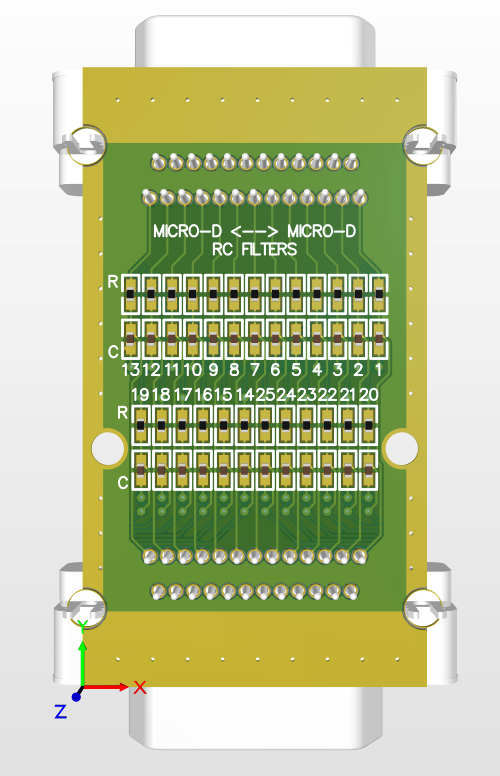
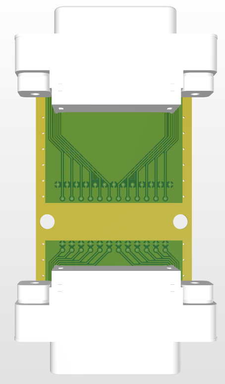

# RC Filters (MicroD) PCB

This PCB adds a low-pass RC filter to each of the 25 DC lines in the Micro-D connectors. It is small enough to fit in Josh Folk's dipstick.

 

## General Notes

* The sides of the Micro-D connector (where the screw holes are) have to be cut off so the connector will fit in the dipstick (not actually shown in the pictures)
* There is exposed GND copper on both sides of the board. This copper must be connected to ground externally since none of the Micro-D lines are a dedicated ground connection
* The Micro-D connectors can be soldered on either side of the board (just be aware the pin numbering reverses)
    * If the Micro-D connectors are soldered on top (the same side as the resistors and capacitors), the pins of the Micro-D connector should be cut to be flush with the bottom of the PCB, soldered, and then wrapped in Teflon tape so they don't get shorted by the metal block in the dipstick

## Ordering Information

| Parameter                    | Value  | Notes |
| ---------------------------- | ------ | ----- |
| Castellated (half-cut) holes | Yes    | |
| Surface finish               | ENIG | |

## BOM

Two Micro-D connectors are required (one male, one female):

| Part Number | Manufacturer | Description | Notes |
| ----------- | ------------ | ----------- | ----- |
| [581-M25-113L461](https://www.digikey.ca/en/products/detail/norcomp-inc/581-M25-113L461/13557494) | NorComp Inc. | Male (Plug) Micro-D Connector | |
| [581-M25-213L461](https://www.digikey.ca/en/products/detail/norcomp-inc/581-M25-213L461/13557502) | NorComp Inc. | Female (Receptacle) Micro-D Connector | |

All capacitors and resistors are 0402 (imperial).