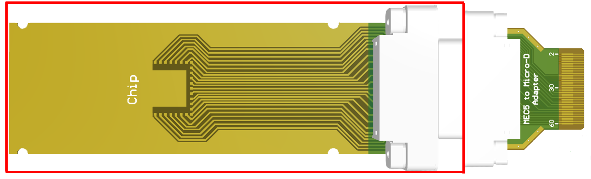
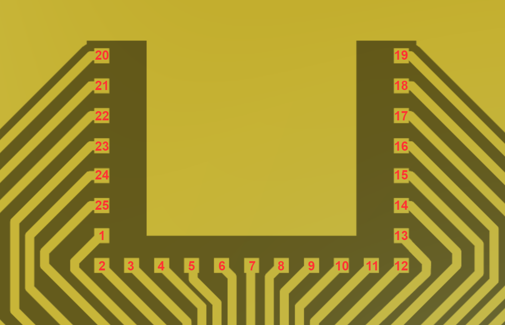
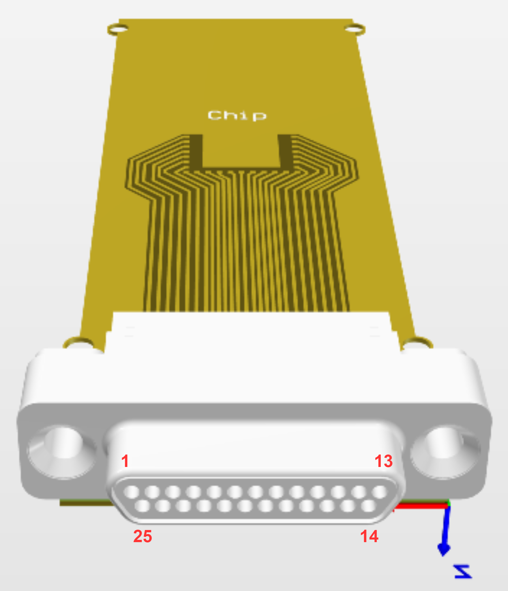

# Sample Holder - DC - Small PCB

This PCB is a modification of the DC sample holder used in the fridge that has a smaller width so it can be used in Josh Folk's dipstick.

## General Notes

* The PCB width was reduced to 25.4mm to fit in the dipstick
* The sides of the Micro-D connector (where the screw holes are) have to be cut off so the connector will fit in the dipstick (not actually shown in the pictures)
* Since the PCB is less wide, the four mounting holes are half-cut (castellated) holes. They can still be used to mount the PCB in the fridge
* The exposed copper "ground" plane is actually floating. A ground wire can be soldered to it if need be.
* The pins of the Micro-D connector should be cut to be flush with the bottom of the PCB, soldered, and then wrapped in Teflon tape so they don't get shorted by the metal block in the dipstick

## Ordering Information

| Parameter                    | Value  | Notes |
| ---------------------------- | ------ | ----- |
| Castellated (half-cut) holes | Yes    | |
| Surface finish               | ENEPIG | Has added palladium, better for wire-bonding than plain ENIG |

## BOM

There are two options for the Micro-D connector listed below:

| Part Number | Manufacturer | Description | Notes |
| ----------- | ------------ | ----------- | ----- |
| [581-M25-113L461](https://www.digikey.ca/en/products/detail/norcomp-inc/581-M25-113L461/13557494) | NorComp Inc. | Male (Plug) Micro-D Connector | This has a dedicated mating female part which is used on the adapter PCB |
| [381-025-112L565](https://www.digikey.ca/en/products/detail/norcomp-inc/381-025-112L565/2798603) | NorComp Inc. | Male (Plug) Micro-D Connector | This doesn't have a dedicated mating female part but should still mate with any female Micro-D connector |

## Pin Mapping

The sample footprint pins map to the Micro-D connector pins as shown below.

 